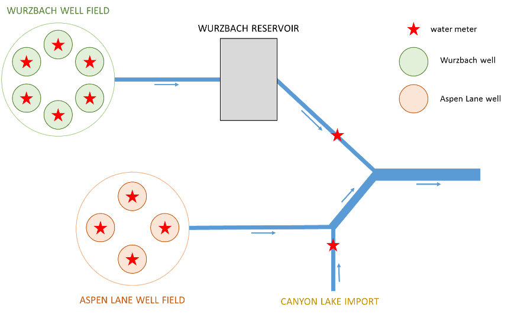

<style type="text/css">
  body{
  font-size: 18pt;
  font-family: Garamond;
}
</style>

```{r setup, include=FALSE}
knitr::opts_chunk$set(echo = TRUE)
```

```{r, include=FALSE}
#Load Packages

library(janitor)
library(tidyverse)
library(RColorBrewer)
```

#   {.tabset}
```{r, include=FALSE}
##Reading in CSV
star = read_csv("example.csv") %>% 
  clean_names()
```

## Background

The Star Utility has three inputs: Canyon Lake, the Aspen Lane Well Field, and the Wurzbach Reservoir (which is fed by the Wurzbach Well Field).



## Overall Production

```{r, include=FALSE}
star_a = star %>% 
  mutate(production=al_well_1+al_well_2+al_well_3+al_well_4+post_reservoir_meter+canyon_lake) %>% 
  mutate(date=as.Date(date)) %>% 
  mutate(wur=wur_well_1+wur_well_2+wur_well_3+wur_well_4+wur_well_5+wur_well_6) %>% 
  mutate(asp = al_well_1+al_well_2+al_well_3+al_well_4) %>% 
  mutate(wur_eff = wur-post_reservoir_meter)

sum(star_a$production)
sum(star_a$wur_eff)
sum(star_a$canyon_lake)
```

The overall water production for the Star Water Utility in 2012 was 15,612 million gallons. 

```{r, echo=FALSE, warning=FALSE, message=FALSE}

production_polt = ggplot(star_a)+
  geom_line(aes(x=date, y=production))+
  
  theme_classic()+
  theme(text=element_text(size=14,
                                  family="Garamond"))+
  xlab("Date")+
  ylab("Production(MG)")+
  scale_y_continuous(expand = c(0,0), limits = c(30,100), breaks = seq(30,100, by = 10))#+
  #scale_y_continuous(expand = c(0,0), breaks = seq(40,140, by = 10))+
  #scale_x_date(expand = c(0,0), breaks=as.Date(c("2012-01-01", "2012-04-01", "2012-07-01", "2012-10-01","2021-12-31")))


production_polt
```
```{r, include=FALSE}
wurzbach=star_a %>% 
  select(date, wur_well_1, wur_well_2, wur_well_3, wur_well_4, wur_well_5, wur_well_6) 

wurzbach_tidy = gather(wurzbach, key = date, value = Production, 
      wur_well_1, wur_well_2, wur_well_3, wur_well_4, wur_well_5, wur_well_6)
```

## Individual Production

Production was highest for Wurzbach Reservoir at 10,540 MG, followed by Canyon Lake at 3,060 MG, and then the Aspen Lane Well Field at 2,010 MG. Canyon Lake had consistent production, but the other sources showed significant fluctuations.
```{r, echo=FALSE, warning=FALSE, message=FALSE}
colors_all <- c("#76b5c5","#e28743","#1e81b0")

all_polt = ggplot(star_a, aes(x=date))+
  #geom_line(aes(x=date, y=wur), color="#1e81b0")+
  geom_line(aes(y=post_reservoir_meter,color="Wurzbach Reservoir"))+
  geom_line(aes(y=canyon_lake, color="Canyon Lake"))+
  geom_line(aes(y=asp,color="Aspen Lane Well Field"))+
  theme_classic()+
  theme(text=element_text(size=14,
                                  family="Garamond"))+
  scale_y_continuous(expand = c(0,0))+
  labs(x="Date", 
       y="Production(MG)", 
       color="Legend")+
  scale_color_manual(values = colors_all)


all_polt
```

## Wurzbach 

The Wurzbach Reservoir is fed by the Wurszbach Well Field. Both show the previously observed spikes in production, indicating the source is in the well field. 
```{r, echo=FALSE, warning=FALSE, message=FALSE}
colors_comp = c("#1e81b0", "#E2E062")
comp_polt = ggplot(star_a)+
  geom_line(aes(x=date, y=wur, color="Wurzbach Well Field"))+
  geom_line(aes(x=date, y=post_reservoir_meter, color="Wurzbach Reservoir"))+
  theme_classic()+
  xlab("Date")+
  ylab("Production(MG)")+
  theme(text=element_text(size=14,
                                  family="Garamond"))+
  scale_y_continuous(expand = c(0,0))+
  labs(x="Date", 
       y="Production(MG)", 
       color="Legend")+
  scale_color_manual(values = colors_comp)


comp_polt
```


These spikes appear to be driven by one well, Well 4. 
```{r, echo=FALSE, warning=FALSE, message=FALSE}

colors_wur= c("#E2E062","#92C467","#52A26F","#277D6D","#1D585E","#203542")

wur_polt = ggplot(star_a)+
  geom_line(aes(x=date, y=wur_well_1, color="Well 1"))+
  geom_line(aes(x=date, y=wur_well_2, color="Well 2"))+
  geom_line(aes(x=date, y=wur_well_3, color="Well 3"))+
  geom_line(aes(x=date, y=wur_well_4, color="Well 4"))+
  geom_line(aes(x=date, y=wur_well_5, color="Well 5"))+
  geom_line(aes(x=date, y=wur_well_6, color="Well 6"))+
  theme_classic()+
  xlab("Date")+
  ylab("Production(MG)")+
  theme(text=element_text(size=14,
                                  family="Garamond"))+
  scale_y_continuous(expand = c(0,0))+
     labs(x="Date", 
       y="Production(MG)", 
       color="Legend")+
  scale_color_manual(values = colors_wur)


wur_polt
```

Well 4 shows spikes of over 60 MG production on March 25, 2012 and May 17, 2012, then reduces in production. 

```{r, echo=FALSE, warning=FALSE, message=FALSE}
colors_w4= "#277D6D"

wur4_polt = ggplot(star_a)+
  geom_line(aes(x=date, y=wur_well_4, color="Well 4"))+
  theme_classic()+
  xlab("Date")+
  ylab("Production(MG)")+
  theme(text=element_text(size=14,
                                  family="Garamond"))+
  scale_y_continuous(expand = c(0,0))+
     labs(x="Date", 
       y="Production(MG)", 
       color="Legend")+
  scale_color_manual(values = colors_w4)


wur4_polt
```


## Aspen Lane

Wells 1, 3, and 4 have zero production values at different times in 2012. Well 1 records two negative production values on May 17th-18th and September 11th-12th.
```{r, echo=FALSE, warning=FALSE, message=FALSE}

colors_asp = c("#43CCCD","#36A3A7","#297B80","#1C565B")
asp_polt = ggplot(star_a)+
  geom_line(aes(x=date, y=al_well_1, color="Well 1"))+
  geom_line(aes(x=date, y=al_well_2, color="Well 2"))+
  geom_line(aes(x=date, y=al_well_3, color="Well 3"))+
  geom_line(aes(x=date, y=al_well_4, color="Well 4"))+
  theme_classic()+
  xlab("Date")+
  ylab("Production(MG)")+
  theme(text=element_text(size=14,
                                  family="Garamond"))+
  scale_y_continuous(expand = c(0,0))+
   labs(x="Date", 
       y="Production(MG)", 
       color="Legend")+
  scale_color_manual(values = colors_asp)


asp_polt
```

## Notes

1. Wurzbach Well 4 had production over 60 MG on March 25, 2012 and May 17, 2012. 

2. Aspen Lane Well 1 had negative production on May 17th-18th and September 11th-12th. Multiple wells recorded zero production for many months.

3. Increases in demand during summer months was satisfied through groundwater as Canyon Lake imports remained consistent throughout the year.

4. Between the spikes observed in Wurzbach Well 4 and the total difference between the Wursbach Well Field and the Wurzbach Reservoir, around 335 MG could potentially be saved through system efficiencies. 

## Questions

1. What is the geological connectivity between water sources? Are any systems hydrologically connected outside of water infrastructure? 

2. What is the calibration schedule for flow meters in Aspen Lane Well Field? Is there a difference between flow meters at the Aspen Lane and the Wurzbach Well Fields?

3. What is the cost per acre-foot for each of your production sources? Which sources would be first priority for efficiency recommendations? 

