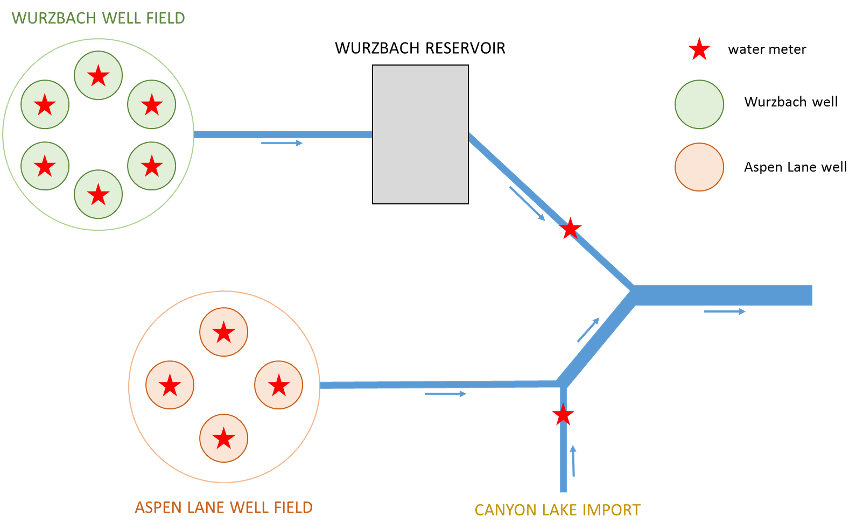

<style type="text/css">
  body{
  font-size: 15pt;
  font-family: Garamond;
}
</style>

```{r setup, include=FALSE}
knitr::opts_chunk$set(echo = TRUE)
```

```{r, include=FALSE}
#Load Packages

library(janitor)
library(tidyverse)
```

#   {.tabset}
```{r, include=FALSE}
##Reading in CSV
star = read_csv("example.csv") %>% 
  clean_names()
```

## Background

The Star Utility has three inputs: Canyon Lake, the Aspen Lane Well Field, and the Wurzbach Reservoir (which is fed by the Wurzbach Well Field)



## Overall Production

```{r, include=FALSE}
star_a = star %>% 
  mutate(production=al_well_1+al_well_2+al_well_3+al_well_4+post_reservoir_meter+canyon_lake) %>% 
  mutate(date=as.Date(date)) %>% 
  mutate(wur=wur_well_1+wur_well_2+wur_well_3+wur_well_4+wur_well_5+wur_well_6) %>% 
  mutate(asp = al_well_1+al_well_2+al_well_3+al_well_4)

sum(star_a$production)
```

```{r, echo=FALSE, warning=FALSE, message=FALSE}
production_polt = ggplot(star_a)+
  geom_line(aes(x=date, y=production))+
  
  theme_classic()+
  theme(text=element_text(size=14,
                                  family="Garamond"))+
  xlab("Days")+
  ylab("Production(MG)")+
  scale_y_continuous(expand = c(0,0), limits = c(30,100), breaks = seq(30,100, by = 10))+
  #scale_y_continuous(expand = c(0,0), breaks = seq(40,140, by = 10))+
  scale_x_date(expand = c(0,0), breaks=as.Date(c("2012-01-01", "2012-04-01", "2012-07-01", "2012-10-01","2021-12-31")))


production_polt
```

## Wurzbach 
```{r, echo=FALSE, warning=FALSE, message=FALSE}
wur_polt = ggplot(star_a)+
  geom_line(aes(x=date, y=wur_well_1), color="blue")+
  geom_line(aes(x=date, y=wur_well_2), color="red")+
  geom_line(aes(x=date, y=wur_well_3), color="green")+
  geom_line(aes(x=date, y=wur_well_4), color="cornflowerblue")+
  geom_line(aes(x=date, y=wur_well_5), color="pink")+
  geom_line(aes(x=date, y=wur_well_6), color="orange")+
  theme_classic()+
  xlab("Days")+
  ylab("Production(MG)")+
  theme(text=element_text(size=14,
                                  family="Garamond"))+
  scale_y_continuous(expand = c(0,0))


wur_polt
```

```{r, echo=FALSE, warning=FALSE, message=FALSE}
comp_polt = ggplot(star_a)+
  geom_line(aes(x=date, y=wur), color="blue")+
  geom_line(aes(x=date, y=post_reservoir_meter), color="red")+
  theme_classic()+
  xlab("Days")+
  ylab("Production(MG)")+
  theme(text=element_text(size=14,
                                  family="Garamond"))+
  scale_y_continuous(expand = c(0,0))


comp_polt
```

## Aspen Lane
```{r, echo=FALSE, warning=FALSE, message=FALSE}
asp_polt = ggplot(star_a)+
  geom_line(aes(x=date, y=al_well_1), color="blue")+
  geom_line(aes(x=date, y=al_well_2), color="red")+
  geom_line(aes(x=date, y=al_well_3), color="green")+
  geom_line(aes(x=date, y=al_well_4), color="orchid")+
  theme_classic()+
  xlab("Days")+
  ylab("Production(MG)")+
  theme(text=element_text(size=14,
                                  family="Garamond"))+
  scale_y_continuous(expand = c(0,0))


asp_polt
```


## Individual Production
```{r, echo=FALSE, warning=FALSE, message=FALSE}
all_polt = ggplot(star_a)+
  geom_line(aes(x=date, y=wur), color="blue")+
  geom_line(aes(x=date, y=post_reservoir_meter), color="red")+
  geom_line(aes(x=date, y=canyon_lake), color="orchid")+
  geom_line(aes(x=date, y=asp), color="green")+
  theme_classic()+
  xlab("Days")+
  ylab("Production(MG)")+
  theme(text=element_text(size=14,
                                  family="Garamond"))+
  scale_y_continuous(expand = c(0,0))


all_polt
```

